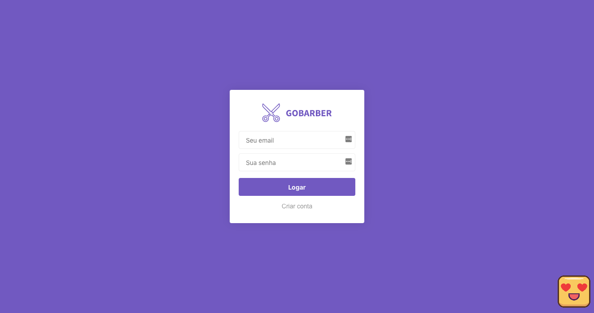
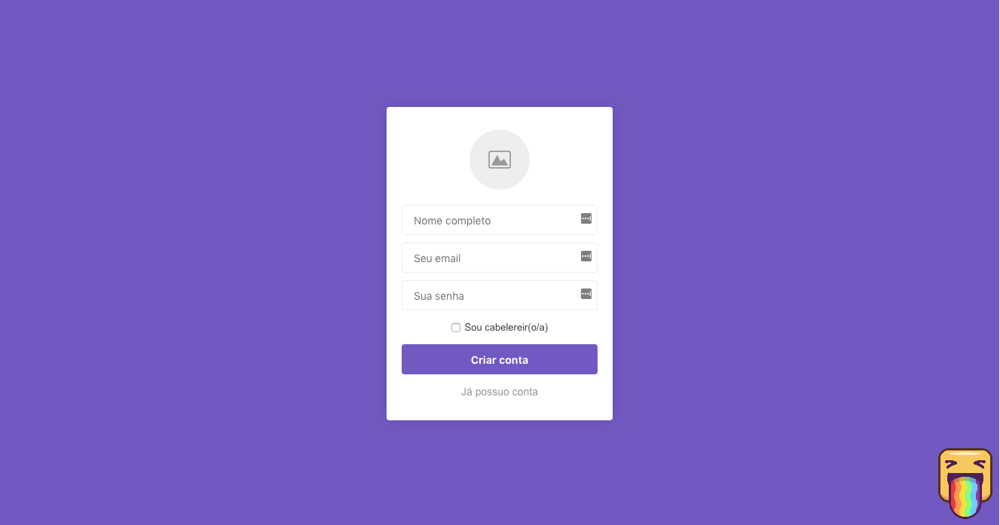
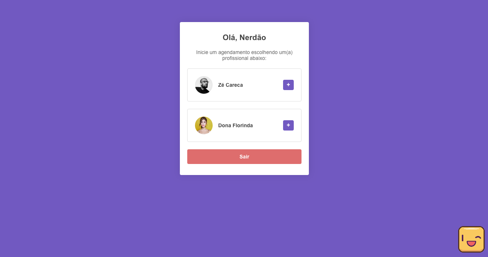
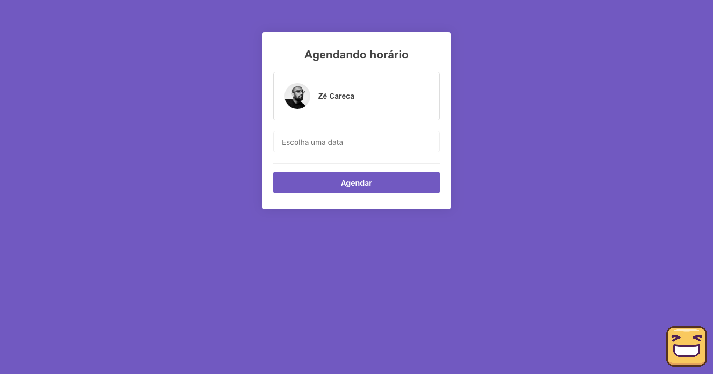
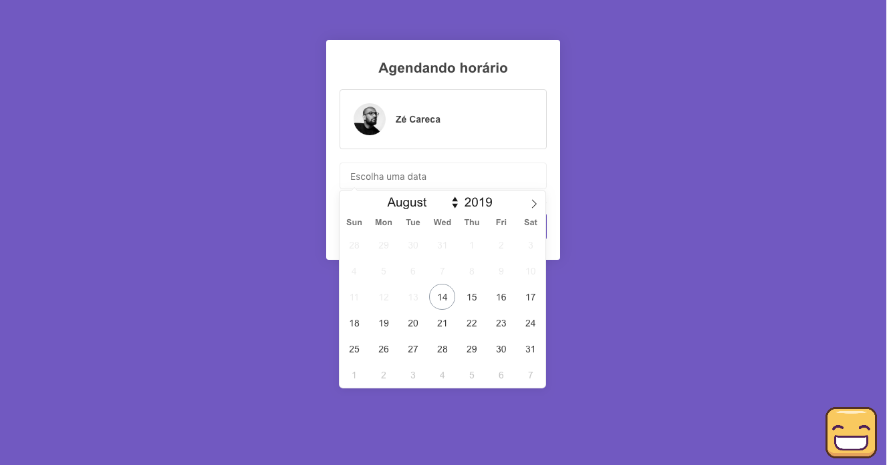
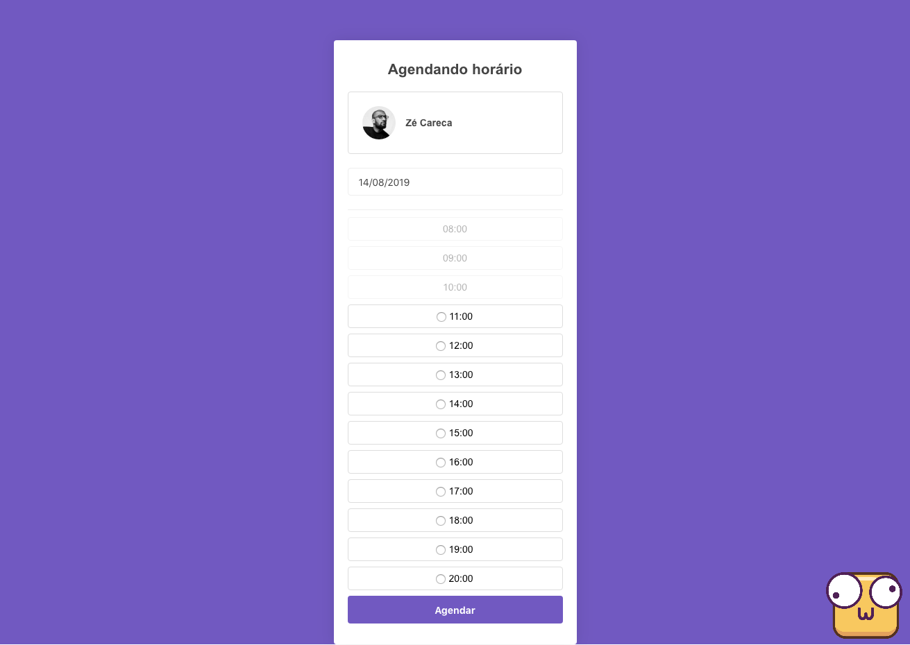

# Projeto GoNode módulo 02 - GoBarber

### O que aprendi neste projeto?
- [x] Estrutura de projeto (MVC).
- [x] ESLint, editorconfig.
- [x] Postgres (Docker, Sequelize).
- [x] Criptografia para autenticação básica.
- [x] Upload de arquivo.
- [x] Autenticação e sessão (session em file store).
- [x] Middlewares.
- [x] Template engine nunjucks.
### O que falta neste projeto?
- [ ] Melhorar verificação de dados nos formulários.
- [ ] Implementar telas com mais informações para ambos os tipos de usuários.
- [ ] Configurar para produção.
- [ ] Colocar este projeto no ar.

### Ficou assim:

    
     
    
     
    
     
    
     
    
     
    
     

